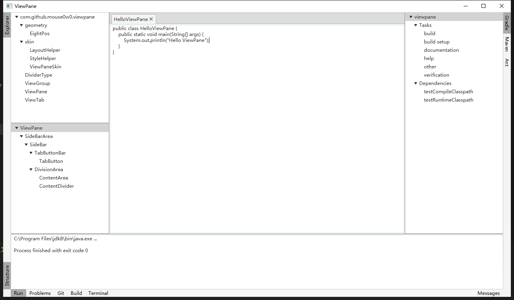

# viewpane

Provide ViewPane control for JavaFX, like as the ToolWindowsPane of IntelliJ or the View of Eclipse.

## Quick links
- [Example](src/test/java/com/github/mouse0w0/viewpane/example/ViewPaneExample.java)
- [Bug / Feature Tracking](https://github.com/Mouse0w0/viewpane/issues)

## Images

